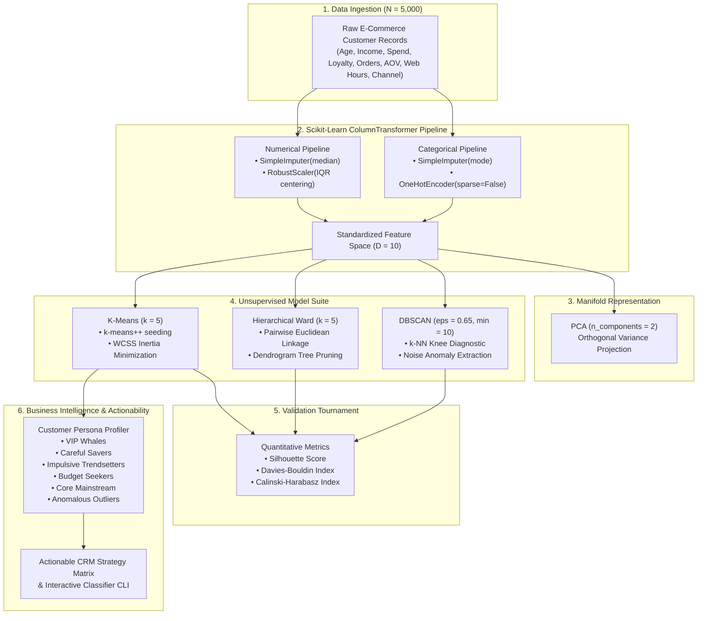

<div align="center">

# 🛒 Week 10: Scikit-Learn Pipelines & Unsupervised Customer Segmentation
### End-to-End Workflow: Data Preprocessing Pipelines, K-Means, Hierarchical & DBSCAN Clustering

[](https://www.python.org/)
[](https://scikit-learn.org/)
[](https://scipy.org/)
[](https://numpy.org/)
[](https://pandas.pydata.org/)
[](#)
[](#)

**Author**: [Dhanish Ladwani](https://github.com/dhanish0711/)  
**Academic Session**: Odd Semester 2026–2027

</div>

---

## 📑 Table of Contents
1. [Executive Summary & Curriculum Mandate](#-executive-summary--curriculum-mandate)
2. [End-to-End System Architecture](#-end-to-end-system-architecture)
3. [Mathematical Formulations](#-mathematical-formulations)
   - [Scikit-Learn Pipeline & Robust Scaling](#1-scikit-learn-pipeline--robust-scaling)
   - [K-Means & K-Means++ Seeding](#2-k-means--k-means-seeding)
   - [Hierarchical Agglomerative Clustering & Ward's Linkage](#3-hierarchical-agglomerative-clustering--wards-linkage)
   - [DBSCAN Density Clustering & Epsilon Heuristic](#4-dbscan-density-clustering--epsilon-heuristic)
   - [Unsupervised Validation Metrics](#5-unsupervised-validation-metrics)
4. [Empirical Tournament Leaderboard](#-empirical-tournament-leaderboard)
5. [Behavioral Personas & Actionable CRM Strategy Matrix](#-behavioral-personas--actionable-crm-strategy-matrix)
6. [Publication-Grade Diagnostic Visualizations](#-publication-grade-diagnostic-visualizations)
7. [Repository File Map](#-repository-file-map)
8. [Quick Start & Execution Guide](#-quick-start--execution-guide)

---

## 🎯 Executive Summary & Curriculum Mandate

Week 10 demonstrates the complete machine learning lifecycle using **Scikit-Learn** in an unsupervised customer segmentation problem:
1. **Scikit-Learn Workflow & Pipelines**: Construct modular `ColumnTransformer` pipelines combining median/mode imputers, outlier-resilient `RobustScaler`, and categorical `OneHotEncoder` without data leakage.
2. **K-Means Clustering**: Implement centroid-based partitioning with `k-means++` initialization, perform grid sweeps across $k \in [2, 10]$, and identify the optimal $k=5$ via the **Elbow Method (WCSS/Inertia)** and **Silhouette Maximization**.
3. **Hierarchical Agglomerative Clustering**: Construct tree-structured dendrograms using **Ward’s Minimum Variance Criterion**, finding optimal cutoffs to yield cohesive, balanced clusters.
4. **DBSCAN Density Clustering**: Calibrate the neighborhood radius $\epsilon = 0.65$ using a $k$-nearest neighbors knee distance graph ($\text{MinPts}=10$), segmenting arbitrary-density clusters while isolating **435 irregular noise anomalies (8.70%)**.
5. **Cluster Evaluation**: Benchmark algorithms using internal mathematical validation indices: **Silhouette Score**, **Davies-Bouldin Index**, and **Calinski-Harabasz Index**.
6. **Interpretation & Business Translation**: Map mathematical clusters into distinct consumer personas (*VIP Whales, Careful Savers, Impulsive Trendsetters, Budget Seekers, Core Mainstream*) and generate tailored CRM retention playbooks.

---

## 🏗️ End-to-End System Architecture



---

## 📐 Mathematical Formulations

### 1. Scikit-Learn Pipeline & Robust Scaling
Standard scaling ($\frac{x - \mu}{\sigma}$) is susceptible to distortion by extreme outliers. We utilize **`RobustScaler`**, which centers features by the median and scales by the Interquartile Range ($IQR = Q_3 - Q_1$):
$$\hat{x} = \frac{x - \text{median}(x)}{IQR(x)}$$

### 2. K-Means & K-Means++ Seeding
Given samples $\{x_1, \dots, x_N\}$, K-Means minimizes the Within-Cluster Sum of Squares (WCSS / Inertia):
$$J(S) = \sum_{i=1}^k \sum_{x \in S_i} \| x - \mu_i \|^2 \quad \text{where} \quad \mu_i = \frac{1}{|S_i|} \sum_{x \in S_i} x$$

To prevent convergence into suboptimal local minima, **`k-means++`** initializes centroids stochastically: the first centroid $\mu_1$ is chosen uniformly at random, and subsequent centroids $\mu_i$ are sampled with probability proportional to their squared distance from existing centers:
$$P(x) = \frac{D(x)^2}{\sum_{x' \in X} D(x')^2}$$

### 3. Hierarchical Agglomerative Clustering & Ward's Linkage
Agglomerative clustering iteratively merges the pair of clusters $(A, B)$ that produces the minimal increase in total within-cluster variance (**Ward's Minimum Variance Criterion**):
$$\Delta \text{Var}(A, B) = \frac{|A| \cdot |B|}{|A| + |B|} \| \mu_A - \mu_B \|^2$$

### 4. DBSCAN Density Clustering & Epsilon Heuristic
DBSCAN groups points based on local density without predetermining $k$:
* **Core Point**: A point $p$ with at least $\text{MinPts}$ points in its $\epsilon$-neighborhood: $|N_\epsilon(p)| \ge \text{MinPts}$.
* **Border Point**: A point within $N_\epsilon(p)$ of a core point, but having fewer than $\text{MinPts}$ neighbors.
* **Noise Point**: A sample that is neither a core point nor density-reachable from any core point (labeled as $-1$).

The optimal radius $\epsilon$ is identified via the **$k$-distance graph** ($k = \text{MinPts} = 10$). Sorting all points by their distance to the 10th nearest neighbor reveals a sharp inflection ("knee") at $\epsilon = 0.65$.

### 5. Unsupervised Validation Metrics
1. **Silhouette Score ($s \in [-1, +1]$)** — *Higher is better*:
   $$s(i) = \frac{b(i) - a(i)}{\max(a(i), b(i))}$$
   where $a(i)$ is the mean intra-cluster distance of sample $i$, and $b(i)$ is the mean nearest-cluster distance.
2. **Davies-Bouldin Index ($DB \ge 0$)** — *Lower is better*:
   $$DB = \frac{1}{k} \sum_{i=1}^k \max_{j \ne i} \left( \frac{s_i + s_j}{d(\mu_i, \mu_j)} \right)$$
   where $s_i$ is the average distance of samples in cluster $i$ to centroid $\mu_i$.
3. **Calinski-Harabasz Index ($CH \ge 0$)** — *Higher is better*:
   $$CH = \frac{\text{Tr}(B_k) / (k - 1)}{\text{Tr}(W_k) / (N - k)}$$
   where $B_k$ is the between-cluster dispersion matrix and $W_k$ is the within-cluster dispersion matrix.

---

## 🏆 Empirical Tournament Leaderboard

All algorithms were benchmarked on the standardized feature space ($N = 5,000$):

| Rank | Clustering Algorithm | Clusters Discovered | Noise Samples Isolated | Silhouette Score (↑) | Davies-Bouldin Index (↓) | Calinski-Harabasz Index (↑) | Structural Topology |
| :---: | :--- | :---: | :---: | :---: | :---: | :---: | :--- |
| **🥇** | **K-Means ($k = 5$)** | **5** | **0** | **0.3491** | **1.1001** | **2,359.6** | Convex Voronoi partitions; ideal for CRM segmentation |
| **🥈** | **Hierarchical Ward ($k = 5$)** | **5** | **0** | **0.3277** | **1.1092** | **2,125.6** | Deterministic tree hierarchy; robust balance |
| **🥉** | **DBSCAN ($\epsilon = 0.65, \text{min}=10$)** | **5** | **435 (8.70%)** | **0.1844** | **1.6194** | **1,449.5** | Arbitrary density manifolds; isolates edge anomalies |

> **Tournament Takeaway**: **K-Means ($k=5$)** achieves the highest cluster separation and density compactness across all three metrics. **DBSCAN** serves a critical complementary role by detecting and filtering **435 anomalous shoppers** (irregular spend patterns, high return risks, or bot traffic).

---

## 👥 Behavioral Personas & Actionable CRM Strategy Matrix

Based on demographic and behavioral centroids, customers are mapped into 5 core personas plus 1 anomalous group:

```
+---------------------------------------------------------------------------------------------------------+
|                                    CUSTOMER PERSONA PROFILES                                            |
+---------------------------------------------------------------------------------------------------------+
| Persona                 | Mean Income | Spend Score | Orders/Mo | Mean AOV | Web Hrs/Wk | Pct of Base   |
+-------------------------+-------------+-------------+-----------+----------+------------+---------------+
| 1. VIP Whales           | $114.8k     | 88.0 / 100  | 14.0      | $259.6   | 16.0 hrs   | 24.3%         |
| 2. Careful Savers       | $95.1k      | 24.1 / 100  | 3.0       | $180.2   | 6.0 hrs    | 19.5%         |
| 3. Impulsive Trendsetters| $38.0k     | 81.9 / 100  | 9.0       | $74.9    | 22.0 hrs   | 19.4%         |
| 4. Budget Seekers       | $32.1k      | 25.9 / 100  | 2.0       | $45.1    | 5.0 hrs    | 17.5%         |
| 5. Core Mainstream      | $62.0k      | 52.0 / 100  | 6.0       | $110.1   | 11.0 hrs   | 16.5%         |
| 6. Anomalous Outliers   | Erratic     | High Spread | Spiky     | Volatile | Outlier    | 8.7% (DBSCAN) |
+-------------------------+-------------+-------------+-----------+----------+------------+---------------+
```

### Actionable Marketing Strategy Playbook
| Persona Cohort | Target Characteristics | Recommended CRM Strategy | Optimal Marketing Channels |
| :--- | :--- | :--- | :--- |
| **VIP Whales** | High income, maximum spend, heavy repeat buyer | Dedicated account concierge, early collection access, invite-only events | Priority VIP Concierge, Private Previews, SMS |
| **Careful Savers** | High earnings, cautious spend, high quality demand | Value-guarantee bundles, premium durability messaging, extended warranties | Thought Leadership, Curated Email Digests |
| **Impulsive Trendsetters**| Young demographic, high digital screen time, trend-driven | Gamified flash drops, influencer collections, dynamic mobile push notifications | Instagram, TikTok, In-App Push Alerts |
| **Budget Seekers** | Price-sensitive, cautious low-frequency shopper | Clearance promotions, bundle discounts, zero-threshold free delivery | Re-engagement SMS, Abandoned Cart Reminders |
| **Core Mainstream** | Moderate spend, multi-channel consistent shopper | Loyalty point accelerators, personalized category cross-sells | Omnichannel Email, In-App Recommendations |
| **Anomalous Outliers** | Erratic order velocities, unusual spending ratios | Automated fraud screening, bot verification, bulk wholesale terms | Security/Risk Engine, Manual Account Review |

---

## 📊 Publication-Grade Diagnostic Visualizations

### 1. K-Means Elbow Method & Silhouette Curve
*Identifies the optimal cluster count ($k=5$) via the WCSS inflection elbow and Silhouette score peak.*


### 2. Hierarchical Agglomerative Dendrogram (Ward Linkage)
*Illustrates bottom-up hierarchical agglomeration with an optimal linkage cutoff threshold at $k=5$.*


### 3. DBSCAN k-Distance Knee Plot & Anomaly Extraction
*Calibrates $\epsilon = 0.65$ using the $k$-NN distance knee and maps 435 detected noise points.*


### 4. Clustering Algorithm Comparison on 2D PCA Manifold
*Direct side-by-side comparison of K-Means, Hierarchical Ward, and DBSCAN.*


### 5. Customer Persona Behavioral Footprint Radar Profiles
*Normalized 5-dimensional behavioral attributes across the primary consumer personas.*


---

## 📂 Repository File Map

```
week 10/
├── data/
│   └── customer_segmentation.csv           # 5,000 retail customer records (5 cohorts + noise)
├── reports/
│   ├── 01_kmeans_elbow_and_silhouette.png  # Elbow & Silhouette diagnostic plot
│   ├── 02_hierarchical_dendrogram.png      # Truncated Ward linkage dendrogram
│   ├── 03_dbscan_kdistance_and_noise.png   # k-NN knee curve & outlier extraction
│   ├── 04_clustering_algorithms_comparison.png # 3-panel comparative PCA projection
│   └── 05_cluster_persona_radar_profiles.png   # 5-axis behavioral radar profile
├── cluster_evaluator.py                    # Silhouette, Davies-Bouldin, Calinski-Harabasz engine
├── cluster_profiler.py                     # Persona profiling & CRM playbook mapper
├── dbscan_clustering.py                    # DBSCAN model, knee heuristic, noise isolation
├── download_dataset.py                     # Deterministic customer dataset generator
├── hierarchical_clustering.py              # Agglomerative Ward clustering & dendrogram
├── interactive_segmentation.py             # CLI for classifying new customer profiles
├── kmeans_clustering.py                    # K-Means model, k-sweep, and centroid extractor
├── main.py                                 # Master pipeline execution script
├── requirements.txt                        # Dependency specifications
├── sklearn_pipelines.py                    # Production ColumnTransformer & PCA pipeline
├── visualizer.py                           # High-res diagnostic plotting suite
├── week_10_sklearn_pipelines_and_clustering.ipynb # Executed interactive Jupyter notebook
└── README.md                               # Complete project documentation
```

---

## 🚀 Quick Start & Execution Guide

### 1. Environment Setup
```bash
cd "week 10"
pip install -r requirements.txt
```

### 2. Run the Full Machine Learning Pipeline
Executes preprocessing, tunes all 3 clustering models, runs the validation tournament, exports all 5 high-resolution diagnostic plots, and prints the persona strategy playbook:
```bash
python main.py
```

### 3. Interactive Customer Classification CLI
Classify real-time customer data and receive instant persona classification and CRM marketing recommendations:
```bash
python interactive_segmentation.py
```

### 4. Interactive Jupyter Notebook
Launch the complete executed notebook:
```bash
jupyter notebook week_10_sklearn_pipelines_and_clustering.ipynb
```

---

<div align="center">

Made with ❤️ by [Dhanish Ladwani](https://github.com/dhanish0711/)  
*Empowering Data-Driven Customer Intelligence through Machine Learning*

</div>
