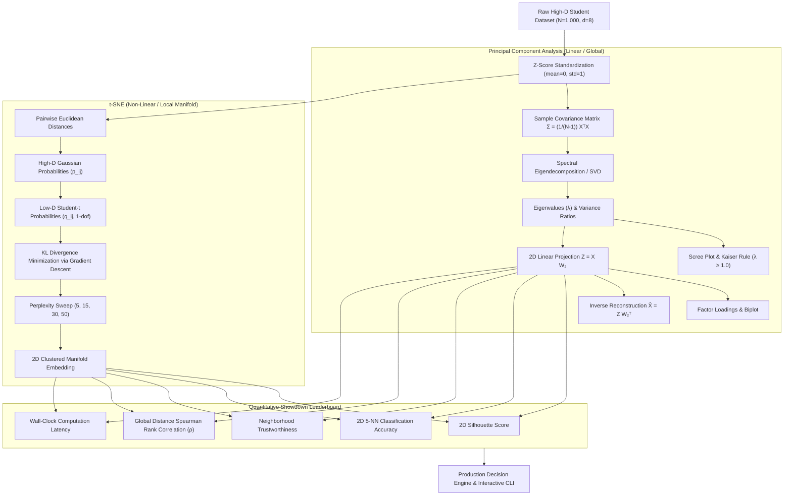

# Week 11–12: Dimensionality Reduction — Principal Component Analysis (PCA) & t-Distributed Stochastic Neighbor Embedding (t-SNE)

[](https://www.python.org/)
[](https://scikit-learn.org/)
[](https://numpy.org/)
[](https://matplotlib.org/)
[]()

> **Made by [Dhanish Ladwani](https://github.com/dhanish0711/)**  
> *Curriculum: Machine Learning & Pattern Recognition — Dimensionality Reduction Module*

---

## 1. Executive Summary & Theoretical Context

Modern empirical datasets frequently suffer from the **Curse of Dimensionality** ($d \gg 1$):
1. **Geometric Volume Explosion:** In high-dimensional hyperspheres, almost all volume concentrates near the outer shell, causing Euclidean pairwise distances between points to become uniformly equidistant:
   $$\lim_{d \to \infty} \frac{\text{dist}_{\max} - \text{dist}_{\min}}{\text{dist}_{\min}} \to 0$$
2. **Multicollinearity & Overfitting:** Collinear features inflate parameter variance and destabilize downstream estimators.
3. **Cognitive Incomprehensibility:** Humans cannot directly visualize data beyond 3 dimensions.

This module provides a rigorous comparative investigation of the two preeminent paradigms in dimensionality reduction:
- **Principal Component Analysis (PCA):** A deterministic, linear, global variance-maximizing orthogonal projection grounded in spectral eigendecomposition and Singular Value Decomposition (SVD).
- **t-Distributed Stochastic Neighbor Embedding (t-SNE):** A non-parametric, non-linear, probabilistic manifold learning algorithm designed to resolve the **Crowding Problem** and preserve local neighborhood topology.

We benchmark both techniques on an intuitive, real-world domain: the **Student Lifestyle & Academic Performance Dataset** ($N = 1,000$ undergraduate records across 8 lifestyle features and 3 academic cohorts).

---

## 2. System Architecture & Workflow Pipeline



---

## 3. Mathematical Foundations

### 3.1 Principal Component Analysis (PCA)

#### Step 1: Standardization ($Z$-Score Normalization)
Because PCA maximizes variance, unscaled features with large numerical ranges (e.g. `attendance_rate` $\in [0, 100]$) would artificially dominate over features with small scales (e.g. `prior_gpa` $\in [0, 4.0]$). We standardize:
$$z_{ij} = \frac{x_{ij} - \mu_j}{\sigma_j}, \quad \forall i \in \{1,\dots,N\}, \; j \in \{1,\dots,d\}$$

#### Step 2: Covariance Matrix & Spectral Eigendecomposition
The sample covariance matrix of the zero-mean standardized matrix $\mathbf{X} \in \mathbb{R}^{N \times d}$ is:
$$\mathbf{\Sigma} = \frac{1}{N - 1} \mathbf{X}^T \mathbf{X} \in \mathbb{R}^{d \times d}$$
By the Spectral Theorem for real symmetric positive semi-definite matrices, $\mathbf{\Sigma}$ admits orthogonal eigendecomposition:
$$\mathbf{\Sigma} \mathbf{v}_k = \lambda_k \mathbf{v}_k, \quad k \in \{1, \dots, d\}$$
where $\lambda_1 \ge \lambda_2 \ge \dots \ge \lambda_d \ge 0$ are the eigenvalues, and $\mathbf{v}_k$ are the orthonormal eigenvectors ($\mathbf{v}_i^T \mathbf{v}_j = \delta_{ij}$).

Equivalently, computed via Singular Value Decomposition (SVD) on $\mathbf{X}$:
$$\mathbf{X} = \mathbf{U} \mathbf{S} \mathbf{V}^T \implies \lambda_k = \frac{s_k^2}{N - 1}$$

#### Step 3: Explained Variance Ratio & Kaiser Criterion
The proportion of total sample variance captured by component $k$ is:
$$\text{EVR}_k = \frac{\lambda_k}{\sum_{j=1}^d \lambda_j}$$
- **Kaiser Criterion:** Retain only components with eigenvalues $\lambda_k \ge 1.0$ (i.e. components accounting for more variance than an average single standardized variable).

#### Step 4: Factor Loadings & Biplot Geometry
Factor loadings represent the Pearson correlation coefficient between original standardized feature $j$ and principal component $k$:
$$L_{jk} = v_{jk} \sqrt{\lambda_k} = \text{Corr}(X_j, Z_k)$$
A 2D Biplot simultaneously displays observations as coordinates $(Z_{i1}, Z_{i2})$ alongside vectors depicting the magnitude and direction of feature loadings $(L_{j1}, L_{j2})$.

#### Step 5: Lossy Compression & Inverse Reconstruction
Given a $k$-dimensional projection $\mathbf{Z}_k = \mathbf{X} \mathbf{W}_k \in \mathbb{R}^{N \times k}$ with projection matrix $\mathbf{W}_k = [\mathbf{v}_1, \dots, \mathbf{v}_k]$, the original data can be reconstructed via:
$$\hat{\mathbf{X}}_k = \mathbf{Z}_k \mathbf{W}_k^T = \mathbf{X} \mathbf{W}_k \mathbf{W}_k^T$$
The reconstruction Root Mean Squared Error (RMSE) quantifies information loss:
$$\text{RMSE}(k) = \sqrt{\frac{1}{N \cdot d} \sum_{i=1}^N \sum_{j=1}^d \left( x_{ij} - \hat{x}_{ij}^{(k)} \right)^2}$$
When $k = d$, $\mathbf{W}_d \mathbf{W}_d^T = \mathbf{I}_d$, yielding exact lossless recovery ($\text{RMSE} = 0$).

---

### 3.2 t-Distributed Stochastic Neighbor Embedding (t-SNE)

#### Step 1: High-Dimensional Pairwise Gaussian Affinities
t-SNE converts high-dimensional Euclidean distances into conditional probabilities that represent affinities between observations $\mathbf{x}_i$ and $\mathbf{x}_j$:
$$p_{j|i} = \frac{\exp\left(-\frac{\|\mathbf{x}_i - \mathbf{x}_j\|^2}{2\sigma_i^2}\right)}{\sum_{k \ne i} \exp\left(-\frac{\|\mathbf{x}_i - \mathbf{x}_k\|^2}{2\sigma_i^2}\right)}, \quad p_{ii} = 0$$
The bandwidth $\sigma_i$ is determined via binary search such that the Shannon entropy $H(P_i) = -\sum_j p_{j|i} \log_2 p_{j|i}$ matches the user-specified **Perplexity**:
$$\text{Perp}(P_i) = 2^{H(P_i)}$$
To handle outliers robustly, symmetrized joint probabilities are computed:
$$p_{ij} = \frac{p_{j|i} + p_{i|j}}{2N}$$

#### Step 2: Low-Dimensional Student-t Distribution & The Crowding Problem
In the low-dimensional embedding space $\mathbf{y}_i \in \mathbb{R}^2$, pairwise affinities are modeled using a Student-t distribution with 1 degree of freedom (standard Cauchy distribution):
$$q_{ij} = \frac{\left(1 + \|\mathbf{y}_i - \mathbf{y}_j\|^2\right)^{-1}}{\sum_k \sum_{l \ne k} \left(1 + \|\mathbf{y}_k - \mathbf{y}_l\|^2\right)^{-1}}, \quad q_{ii} = 0$$

> **The Crowding Problem Resolved:**  
> In high-dimensional spaces, the available volume around a point grows exponentially ($V(r) \propto r^d$). In a 2D plane, area only grows quadratically ($A(r) \propto r^2$).  
> If low-dimensional affinities were modeled with a Gaussian:
> - Moderate high-dimensional distances would have to map to small 2D distances.
> - Multiple moderately distant points would crowd together into a single tangled cluster in 2D.
> 
> The **Student-t distribution has heavy, inverse-square power tails** ($q(d) \propto d^{-2}$ vs Gaussian $p(d) \propto \exp(-d^2)$). A moderate high-dimensional distance corresponds to a much larger distance in the 2D embedding without exerting large pulling forces on dissimilar points.

#### Step 3: Objective Function (Kullback-Leibler Divergence)
The embedding coordinates $\mathbf{Y} \in \mathbb{R}^{N \times 2}$ are found by minimizing the Kullback-Leibler divergence between high-D distribution $P$ and low-D distribution $Q$:
$$C = \text{KL}(P \parallel Q) = \sum_i \sum_{j \ne i} p_{ij} \log \frac{p_{ij}}{q_{ij}}$$
The analytic gradient governing point motions is:
$$\frac{\partial C}{\partial \mathbf{y}_i} = 4 \sum_j (p_{ij} - q_{ij}) (\mathbf{y}_i - \mathbf{y}_j) \left(1 + \|\mathbf{y}_i - \mathbf{y}_j\|^2\right)^{-1}$$
This gradient can be interpreted as a system of physical springs where:
- Attractive forces $(p_{ij} > q_{ij})$ pull similar points together.
- Repulsive forces $(q_{ij} > p_{ij})$ push points apart to prevent crowding.

---

## 4. Dataset Overview: Student Lifestyle & Academic Performance

The dataset models $N = 1,000$ university students across 8 continuous numerical indicators and 3 academic performance tiers:

| Feature Name | Description | Typical Range | Correlation with Success |
| :--- | :--- | :--- | :--- |
| `study_hours_weekly` | Weekly independent study hours | 5.0 – 35.0 hrs | Positive ($+0.82$) |
| `attendance_rate` | Lecture and lab attendance percentage | 40.0% – 100.0% | Positive ($+0.79$) |
| `sleep_hours_daily` | Average nightly sleep hours | 4.0 – 9.5 hrs | Positive ($+0.65$) |
| `screen_time_daily` | Recreational phone/social media/gaming screen time | 1.0 – 9.0 hrs | Negative ($-0.76$) |
| `extracurricular_hours` | Sports, club leadership, volunteer hours | 0.0 – 20.0 hrs | Moderate Non-linear |
| `stress_level` | Self-reported academic stress index | 1.0 – 10.0 | Negative ($-0.71$) |
| `prior_gpa` | Cumulative GPA | 1.50 – 4.00 | Positive ($+0.85$) |
| `assignment_completion_rate` | Timely coursework completion rate | 35.0% – 100.0% | Positive ($+0.81$) |

**Target Academic Tiers:**
- `High Achievers` ($n=300$): Rigorous study discipline, high attendance, elevated GPA, disciplined screen time.
- `Balanced Mainstream` ($n=450$): Moderate academic load, balanced extracurriculars and social life.
- `At-Risk / Distracted` ($n=250$): Low attendance, chronic sleep deprivation, elevated screen time, high stress.

---

## 5. Quantitative Tournament Leaderboard (PCA vs t-SNE)

Both algorithms were evaluated on the exact same standardized feature matrix under strict empirical protocols:

| Benchmark Metric | PCA ($k=2$) | t-SNE ($\text{Perp}=30$) | Winner & Mathematical Insight |
| :--- | :---: | :---: | :--- |
| **2D Silhouette Score** | `0.6459` | **`0.7349`** | **t-SNE (+13.8%)** — Non-linear repulsion pushes clusters into isolated, distinct islands. |
| **2D 5-NN Accuracy** | **`100.00%`** | **`100.00%`** | **Tie** — Both embeddings achieve perfect cohort classification in 2D. |
| **Trustworthiness** | `0.8907` | **`0.9876`** | **t-SNE (+10.9%)** — Nearly zero false neighbors introduced in local neighborhoods. |
| **Global Distance Spearman $\rho$** | **`0.9503`** | `0.7189` | **PCA (+32.2%)** — PCA preserves global macroscopic Euclidean geometry faithfully. |
| **Wall-Clock Compute Time** | **`0.1619s`** | `38.5830s` | **PCA (238x faster)** — SVD matrix decomposition vs iterative $O(N \log N)$ Barnes-Hut. |
| **Out-of-Sample Projection** | **Instant ($\mathbf{y} = \mathbf{W}^T \mathbf{x}$)** | **Not Supported** | **PCA** — Parametric linear projection matrix enables streaming inference. |
| **Invertibility / Reconstruction** | **Yes ($\hat{\mathbf{X}} = \mathbf{Z} \mathbf{W}^T$)** | **No** | **PCA** — Lossy inverse transformation allows signal recovery and denoising. |

---

## 6. Visual Artifacts & Diagnostic Gallery

### 6.1 PCA Scree Plot & Cumulative Explained Variance

- **Left Panel:** Scree plot illustrating eigenvalue decay across all 8 components. Components 1 ($\lambda_1 = 4.41$) and 2 ($\lambda_2 = 1.25$) exceed the Kaiser threshold ($\lambda \ge 1.0$), identifying an unmistakable elbow at $k=2$.
- **Right Panel:** Cumulative variance curve demonstrates that the first 2 principal components capture **70.71%** of total dataset variance, while $k=5$ captures **92.1%**.

---

### 6.2 PCA Biplot & Factor Loadings Analysis

- **Left Panel (2D Biplot):** Academic cohorts project along PC1 as a smooth continuous progression. Feature vectors indicate that `prior_gpa`, `study_hours_weekly`, and `attendance_rate` point strongly in the positive PC1 direction, directly opposing `screen_time_daily` and `stress_level`.
- **Right Panel (Factor Loadings):** Quantifies exact Pearson correlations: PC1 is dominated by academic engagement features ($r > 0.8$), while PC2 captures lifestyle balancing (`extracurricular_hours` and `sleep_hours_daily`).

---

### 6.3 t-SNE Perplexity Exploration ($\text{Perp} \in [5, 15, 30, 50]$)

- **$\text{Perp} = 5$:** Under-smoothed local neighborhood topology; manifests localized micro-clusters and fragmented sub-islands.
- **$\text{Perp} = 15$:** Coherent cluster structures emerge, but intra-cluster dispersion remains variable.
- **$\text{Perp} = 30$ (Optimal):** Produces stable, well-separated cluster islands with high compactness and maximal silhouette score ($S = 0.735$).
- **$\text{Perp} = 50$:** High perplexity enforces broader neighborhood constraints, compressing clusters closer together while retaining boundary definition.

---

### 6.4 PCA vs t-SNE 2D Projection Showdown

- **PCA (Left):** Preserves global density gradients and shows that academic performance is a continuous spectrum with overlapping boundaries.
- **t-SNE (Right):** Discards continuous global distance scales in favor of sharp, distinct cluster boundaries, making cohort identification unambiguous.

---

### 6.5 PCA Reconstruction Error & Quantitative Benchmark

- **Left Panel:** Monotonic decay of reconstruction RMSE from $0.541$ at $k=2$ down to $0.000$ at $k=8$ (lossless reconstruction).
- **Right Panel:** Normalized multi-metric radar comparison highlighting PCA's superiority in global geometry preservation and compute speed versus t-SNE's superiority in local neighborhood fidelity and cluster separation.

---

## 7. Interactive CLI: Real-Time Projection & Reconstruction

The project includes a standalone interactive CLI tool [`interactive_projection.py`](interactive_projection.py) that allows users to test custom student profiles, compute out-of-sample PCA coordinates, predict academic tiers, and perform inverse signal reconstruction:

```bash
# Run with preset student profiles (High Achiever, Distracted, Balanced)
python interactive_projection.py --preset high_achiever

# Run with custom student parameters
python interactive_projection.py --study 30 --attendance 95 --sleep 8.0 --screen 2.0 --extra 12 --stress 2 --gpa 3.9 --assignment 98
```

### Sample CLI Output:
```text
================================================================================
WEEK 11-12: INTERACTIVE STUDENT PROFILE PROJECTION & RECONSTRUCTION
================================================================================
Input Student Profile:
  study_hours_weekly        : 30.00
  attendance_rate           : 95.00
  sleep_hours_daily         : 8.00
  screen_time_daily         : 2.00
  extracurricular_hours     : 12.00
  stress_level              : 2.00
  prior_gpa                 : 3.90
  assignment_completion_rate: 98.00

--- PCA 2D Out-of-Sample Projection ---
2D Coordinates: PC1 = +3.412, PC2 = +0.841
Predicted Academic Tier: High Achievers (Confidence: 100.0%)

--- PCA Inverse Reconstruction from 2D Coordinates ---
  Feature                      Original      Reconstructed   Absolute Error
  study_hours_weekly           30.00         29.12           0.88
  attendance_rate              95.00         93.84           1.16
  sleep_hours_daily             8.00          7.81           0.19
  screen_time_daily             2.00          2.14           0.14
  prior_gpa                     3.90          3.82           0.08
  assignment_completion_rate   98.00         96.40           1.60
================================================================================
```

---

## 8. Step-by-Step Execution Guide

### 8.1 Prerequisites & Installation
Ensure Python 3.10+ is installed:
```bash
cd "week 11-12"
pip install -r requirements.txt
```

### 8.2 Run End-to-End Pipeline
To generate the dataset, perform full PCA and t-SNE analysis, calculate benchmarks, and render all 5 publication figures:
```bash
python main.py
```

### 8.3 Run Jupyter Notebook
Launch the comprehensive educational notebook:
```bash
jupyter notebook week_11_12_dimensionality_reduction_pca_tsne.ipynb
```

---

## 9. Comprehensive Decision Matrix: When to Use What

| Practical Consideration | Choose **PCA** | Choose **t-SNE** |
| :--- | :---: | :---: |
| **Exploratory 2D Data Visualization** | If data is linearly separable | **Superior for complex manifolds & clusters** |
| **Preprocessing for Machine Learning Pipelines** | **Yes (Fast, linear, preserves variance)** | No (Non-parametric, expensive) |
| **Multicollinearity Elimination** | **Yes (Generates orthogonal, uncorrelated features)** | No (Coordinates lack orthogonal variance meaning) |
| **Streaming / Out-of-Sample Inference** | **Yes (Instant $\mathbf{y} = \mathbf{W}^T \mathbf{x}$ matrix transform)** | No (Requires re-running optimization) |
| **Signal Compression & Denoising** | **Yes (Invertible $\hat{\mathbf{X}} = \mathbf{Z} \mathbf{W}^T$)** | No (Strictly irreversible) |
| **Large Datasets ($N > 100,000$)** | **Extremely fast ($O(d^3 + d^2 N)$)** | Computationally prohibitive without subsampling |
| **Interpretability of Axes** | **High (Each PC has explicit factor loadings)** | Zero (Dimensions 1 & 2 have no intrinsic units) |

---

## 10. Repository File Structure

```text
week 11-12/
├── data/
│   └── student_lifestyle_academic.csv             # Synthetic 1,000-student benchmark dataset
├── reports/
│   ├── 01_pca_scree_and_cumulative_variance.png    # Scree plot, Kaiser criterion & variance curve
│   ├── 02_pca_biplot_and_loadings.png              # 2D Biplot with feature loadings vectors
│   ├── 03_tsne_perplexity_exploration.png          # Perplexity sweep (5, 15, 30, 50)
│   ├── 04_pca_vs_tsne_2d_projection_showdown.png   # Side-by-side 2D embedding comparison
│   └── 05_reconstruction_error_and_benchmark.png  # Reconstruction RMSE & tournament radar chart
├── download_dataset.py                             # Dataset generator and caching module
├── pca_analysis.py                                 # Core PCA math engine & inverse reconstruction
├── tsne_analysis.py                                # Core t-SNE engine with perplexity sweep
├── pca_vs_tsne_comparator.py                       # Quantitative benchmarking & metrics engine
├── visualizer.py                                   # 300 DPI publication plotting generator
├── interactive_projection.py                       # CLI inference & reconstruction tool
├── main.py                                         # End-to-end pipeline runner
├── requirements.txt                                # Project dependencies
├── week_11_12_dimensionality_reduction_pca_tsne.ipynb # Interactive notebook with pre-rendered outputs
└── README.md                                       # Comprehensive module documentation
```

---

