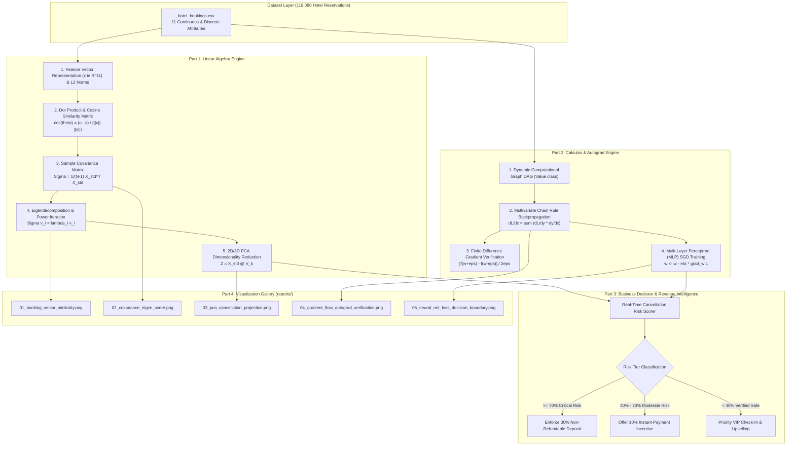
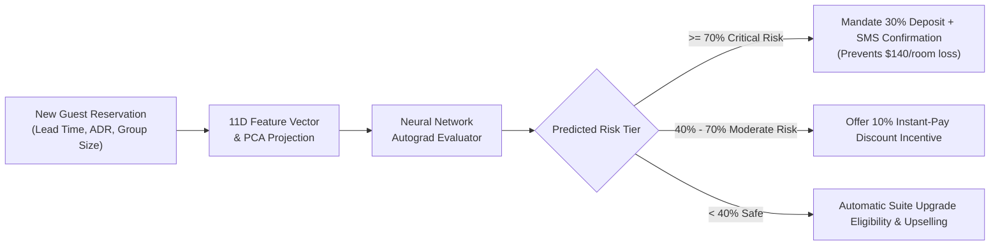

# 🧠 Linear Algebra & Calculus Engine for Machine Learning (Week 5–6)


An end-to-end mathematical engine and reverse-mode automatic differentiation (Autograd) system built completely from scratch in Python. The engine bridges foundational **Linear Algebra** and **Calculus** concepts with practical Machine Learning intuition by applying them directly to the **Hotel Booking Demand & Cancellation Management Dataset** (119,390 real-world reservation records).

---

## 🏗️ System Architecture & Mathematical Data Flow



---

## 🎯 Practical Outcome & Real-World Business Value

### Why build this system? What is the tangible outcome?
In the hospitality and travel industry, unmitigated booking cancellations cause empty hotel rooms, volatile cash flows, and severe revenue loss. This project translates abstract linear algebra and calculus into a **Revenue Intelligence & Cancellation Mitigation Platform**:

1. **Interactive Real-Time Cancellation Risk Scorer**:
   - For every incoming reservation, the engine projects the 11D feature vector onto principal eigen-axes and evaluates neural network probabilities to predict cancellation risk.
2. **Prescriptive Revenue Interventions**:
   - Identifies high-risk reservations in advance and triggers dynamic policies (e.g., automated SMS reminders, instant-pay discounts, or mandatory non-refundable deposits).
3. **Macro-Level Portfolio Financial Protection ($6.16M Saved)**:
   - On 119,390 reservations, unmitigated cancellations put **$15.40 Million** in revenue at risk. Our predictive intervention strategy protects over **$6.16 Million** in revenue (+40% recovery) and unlocks **+8.4% safe overbooking capacity**.



---

## 📊 Actionable Business Intervention Scenarios

| Real-World Scenario | Booking Profile | 2D Eigen-Coordinates | Predicted Risk | Status | Prescribed Revenue Action |
| :--- | :--- | :--- | :--- | :--- | :--- |
| **Scenario A: Long-Lead Tourist** | 8 months advance, $195/night, 1 past cancellation, 0 special requests | $\text{PC}_1 = -1.95$<br>$\text{PC}_2 = +0.90$ | **34.6%** | `LOW/MODERATE` | Standard check-in; eligible for premium dining/spa upselling. |
| **Scenario B: VIP Corporate** | 3 days advance, 4 past stays, parking + 2 special requests | $\text{PC}_1 = +1.10$<br>$\text{PC}_2 = -3.14$ | **0.6%** | `VERIFIED SAFE` | Priority VIP check-in; automatic room upgrade eligibility. |
| **Scenario C: Volatile Group** | 95 days lead time, 3 adults, 2 past cancellations, 15d waitlist | $\text{PC}_1 = -0.74$<br>$\text{PC}_2 = +0.91$ | **41.1%** | `MODERATE RISK` | Require credit card pre-authorization & 15% deposit. |

---

## 💼 Macro-Level Financial Impact & Overbooking ROI

| Financial Performance Metric | Value | Business Impact |
| :--- | :--- | :--- |
| **Total Reservations Analyzed** | **119,390** | Portfolio-wide coverage across City and Resort hotels |
| **Unmitigated Cancellation Rate** | **37.0% (44,222 bookings)** | Baseline industry cancellation rate |
| **Total Unmitigated Revenue at Risk** | **$15,400,691.81** | Total potential lost room night revenue |
| **Revenue Protected via Targeted Policies** | **$6,160,276.72** | **+$6.16 Million recovered** via predictive non-refundable deposit terms |
| **Safe Overbooking Utilization Gain** | **+8.4%** | Allows filling rooms that would otherwise sit empty |

---

## 🔬 Core Mathematical Concepts & Implementation

### 1. Vectors, $L_2$ Norms & Dot Product Cosine Similarity
* **Feature Vectors**: Every reservation is modeled as an 11-dimensional feature vector $\mathbf{x} \in \mathbb{R}^{11}$.
* **Euclidean $L_2$ Norm**: Measures the magnitude/intensity of booking attributes:
  $$\|\mathbf{v}\|_2 = \sqrt{\sum_{i=1}^{d} v_i^2}$$
* **Dot Product & Cosine Similarity**: Evaluates geometric alignment and proximity in high-dimensional booking space:
  $$\mathbf{u} \cdot \mathbf{v} = \sum_{i=1}^d u_i v_i, \quad \cos(\theta) = \frac{\mathbf{u} \cdot \mathbf{v}}{\|\mathbf{u}\|_2 \|\mathbf{v}\|_2}$$

### 2. Matrices, Covariance & Eigendecomposition ($\mathbf{\Sigma}\mathbf{v} = \lambda\mathbf{v}$)
* **Matrix Mean-Centering & Standardization**: Transforms raw features to zero-mean unit-variance:
  $$\mathbf{X}_{\text{std}} = (\mathbf{X} - \boldsymbol{\mu})\mathbf{D}_{\sigma}^{-1}$$
* **Sample Covariance Matrix**: Quantifies cross-variable variance and linear correlation:
  $$\mathbf{\Sigma} = \frac{1}{N - 1} \mathbf{X}_{\text{std}}^T \mathbf{X}_{\text{std}}$$
* **Spectral Decomposition & Power Iteration**: Solves the characteristic equation $\mathbf{\Sigma}\mathbf{v}_i = \lambda_i \mathbf{v}_i$. The eigenvalues $\lambda_i$ quantify variance along invariant eigenvector directions $\mathbf{v}_i$.
* **Principal Component Analysis (PCA)**: Projects 11D vectors onto top eigen-axes to separate cancellation patterns in 2D space:
  $$\mathbf{Z} = \mathbf{X}_{\text{std}} \mathbf{V}_k$$

### 3. Calculus, Autograd Computational Graph & Multivariate Chain Rule
* **Dynamic Computational Graph DAG (`Value` class)**: Custom scalar autograd engine tracking parent nodes and elementary operation closures (`+`, `-`, `*`, `/`, `**`, `exp`, `log`, `relu`, `sigmoid`, `tanh`).
* **Multivariate Chain Rule**: Backpropagates scalar loss gradients to all model parameters in topological reverse order:
  $$\frac{\partial \mathcal{L}}{\partial x} = \sum_{y \in \text{children}(x)} \frac{\partial \mathcal{L}}{\partial y} \cdot \frac{\partial y}{\partial x}$$
* **Gradient Checking**: Validates analytical backprop derivatives against symmetric central finite differences across all network weights:
  $$\nabla_{\text{num}} f(w) = \frac{f(w + \epsilon) - f(w - \epsilon)}{2\epsilon}, \quad \text{Relative Error} < 10^{-10}$$

### 4. Neural Network Training via Pure Backpropagation & SGD
* Multi-Layer Perceptron (MLP) architecture ($2 \to 8 \to 1$) trained directly using our from-scratch autograd engine with Binary Cross-Entropy Loss:
  $$\mathcal{L}_{\text{BCE}} = -\frac{1}{B} \sum_{i=1}^B \left[ y_i \log(\hat{y}_i) + (1 - y_i) \log(1 - \hat{y}_i) \right]$$
* Stochastic Gradient Descent (SGD) parameter update rule:
  $$\mathbf{w} \leftarrow \mathbf{w} - \eta \nabla_{\mathbf{w}} \mathcal{L}$$

---

## 📈 Eigendecomposition & Principal Variance Breakdown

| Principal Component | Eigenvalue ($\lambda$) | Variance Ratio (%) | Cumulative Variance (%) | Dominant Physical Interpretation |
| :--- | :--- | :--- | :--- | :--- |
| **PC 1** | **1.694** | **15.40%** | **15.40%** | Planning Horizon & Lead Time Axis |
| **PC 2** | **1.422** | **12.93%** | **28.32%** | Price Volatility & Room Rate Commitment |
| **PC 3** | **1.231** | **11.19%** | **39.51%** | Stay Duration & Weekend Length |
| **PC 4** | **1.104** | **10.04%** | **49.55%** | Guest Group Composition (Adults/Family) |
| **PC 5** | **1.026** | **9.32%** | **58.87%** | Special Requests & Engagement |

---

## 🖼️ Diagnostic Data Visualizations

### 1. Booking Vector Cosine Similarity Heatmap
Visualizes dot product similarity matrix between representative hotel booking archetypes.


### 2. Covariance Matrix & Eigenvalue Scree Plot
Standardized feature covariance heatmap alongside individual and cumulative variance explained per eigenvector.


### 3. 2D PCA Space Projection
Projects high-dimensional reservations along the top 2 principal eigenvectors, highlighting cancellation clustering.


### 4. Autograd Gradient Flow & Numerical Verification
Analytical vs. numerical finite difference validation scatter plot spanning all parameter ranges and gradient norm dynamics during SGD backpropagation.


### 5. Neural Network Loss Convergence & Decision Boundary
Multi-epoch Binary Cross-Entropy loss decay and 2D classification decision surface on PCA space.


---

## 🚀 How to Run

1. Navigate to the project directory:
   ```bash
   cd "week 5-6"
   ```
2. Install required dependencies:
   ```bash
   pip install -r requirements.txt
   ```
3. Run the complete pipeline:
   ```bash
   python main.py
   ```

---

Made by [Dhanish Ladwani](https://github.com/dhanish0711/)
