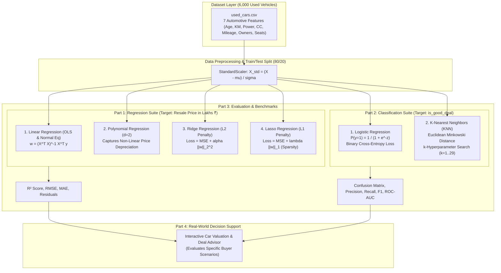
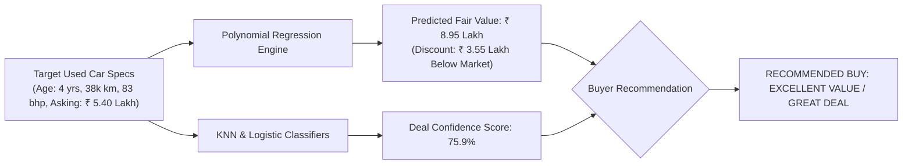

# 🚗 Used Car Valuation & Deal Quality Intelligence Engine (Week 7–8)


An end-to-end Machine Learning suite covering classical **Regression** and **Classification** algorithms applied directly to a realistic **Used Car Resale Market Dataset** (6,000 vehicle transactions).

---

## 🏗️ System Architecture & Machine Learning Pipeline



---

## 🎯 Practical Outcome & Real-World Use Case

In the used automobile market, individual buyers and dealerships face asymmetrical information:
1. **Accurate Price Valuation**: What is the true fair market resale price of a car given its age, mileage, engine displacement, and power?
2. **Deal Quality Scoring**: Is a seller's asking price an **underpriced bargain (Great Deal)** or an **overpriced trap**?
3. **Depreciation Trajectory**: How rapidly will the vehicle lose value over subsequent ownership years?

Our platform combines **Polynomial Regression** (achieving an exceptional **$R^2 = 0.9318$**) with **Logistic Regression / KNN** (achieving **79.92% classification accuracy** and **0.835 ROC-AUC**) to deliver instant, automated valuation and deal advisories.

---

## 📊 Actionable Buyer Scenario Evaluation



| Real-World Scenario | Vehicle Profile | Seller Asking Price | Model Fair Value Est | Confidence Score | Buyer Recommendation |
| :--- | :--- | :--- | :--- | :--- | :--- |
| **Scenario 1: Daily Commuter Hatchback** | 4 yrs old, 38,000 km, 1.2L petrol, 83 bhp, 20.5 km/l, single owner | **₹ 5.40 Lakh** | **₹ 8.95 Lakh** | **75.9%** | `EXCELLENT VALUE / GREAT DEAL [RECOMMENDED BUY]` |
| **Scenario 2: Highway Family SUV** | 3 yrs old, 42,000 km, 2.0L diesel, 168 bhp, 15.2 km/l, 7-seater | **₹ 14.80 Lakh** | **₹ 14.03 Lakh** | **24.1%** | `OVERPRICED [NEGOTIATE DOWN OR WALK AWAY]` |
| **Scenario 3: High-Mileage Sedan** | 9 yrs old, 115,000 km, 1.5L petrol, 118 bhp, 3 previous owners | **₹ 4.10 Lakh** | **₹ 2.61 Lakh** | **13.8%** | `OVERPRICED [NEGOTIATE DOWN OR WALK AWAY]` |

---

## 🏆 Model Performance Leaderboard

### 1. Regression Tournament (Predicting Resale Price in ₹ Lakhs)

| Rank | Model Architecture | $R^2$ Score (Higher is Better) | RMSE (₹ Lakhs) | MAE (₹ Lakhs) | Key Takeaway |
| :---: | :--- | :---: | :---: | :---: | :--- |
| 🥇 | **Polynomial Regression ($d=2$)** | **0.9318** | **₹ 1.29 Lakh** | **₹ 0.89 Lakh** | **Top Performer**: Captures non-linear early-year price depreciation. |
| 🥈 | **Ridge Regression ($L_2, \alpha=10$)** | **0.8467** | **₹ 1.94 Lakh** | **₹ 1.48 Lakh** | Prevents collinearity between engine displacement and horsepower. |
| 🥉 | **Linear Regression (OLS)** | **0.8467** | **₹ 1.94 Lakh** | **₹ 1.48 Lakh** | Closed-form Normal Equation baseline. |
| 4 | **Lasso Regression ($L_1, \alpha=0.08$)** | **0.8464** | **₹ 1.94 Lakh** | **₹ 1.46 Lakh** | Induces feature sparsity; isolates dominant pricing drivers. |

### 2. Classification Tournament (Predicting "Good Deal" Status)

| Rank | Model Architecture | Accuracy (%) | Precision (%) | Recall (%) | $F_1$-Score (%) | ROC-AUC |
| :---: | :--- | :---: | :---: | :---: | :---: | :---: |
| 🥇 | **Logistic Regression** | **79.92%** | **82.08%** | **28.16%** | **41.93%** | **0.835** |
| 🥈 | **K-Nearest Neighbors ($k=29$)** | **77.00%** | **61.70%** | **28.16%** | **38.67%** | **0.811** |

---

## 🔬 Core Mathematical Principles & Algorithms

### 1. Linear Regression (Ordinary Least Squares)
* **Hypothesis**:
  $$\hat{y} = \mathbf{w}^T \mathbf{x} + b = \sum_{i=1}^d w_i x_i + b$$
* **Closed-Form Normal Equation**:
  $$\mathbf{w} = (\mathbf{X}^T \mathbf{X})^{-1} \mathbf{X}^T \mathbf{y}$$

### 2. Polynomial Regression & Bias-Variance Tradeoff
* **Basis Expansion**: Transforms features into higher degrees:
  $$\phi(\mathbf{x}) = [1, x_1, x_2, x_1^2, x_2^2, \dots]$$
* **Bias-Variance Dynamics**: Degree 1 underfits (high bias); Degree 2 achieves minimum test MSE; Degree 4+ overfits with erratic boundary predictions (high variance).

### 3. Regularization Showdown: Ridge ($L_2$) vs. Lasso ($L_1$)
* **Ridge Regression ($L_2$)**:
  $$\mathcal{L}_{\text{Ridge}} = \frac{1}{N} \sum_{i=1}^N (y_i - \hat{y}_i)^2 + \alpha \|\mathbf{w}\|_2^2, \quad \mathbf{w} = (\mathbf{X}^T\mathbf{X} + \alpha \mathbf{I})^{-1}\mathbf{X}^T\mathbf{y}$$
  *Continuously shrinks coefficients toward zero without setting them to exact zero.*
* **Lasso Regression ($L_1$)**:
  $$\mathcal{L}_{\text{Lasso}} = \frac{1}{N} \sum_{i=1}^N (y_i - \hat{y}_i)^2 + \lambda \|\mathbf{w}\|_1$$
  *Solved via Coordinate Descent with soft-thresholding ($S(z, \gamma) = \text{sign}(z)\max(0, |z|-\gamma)$); drives uninformative coefficients to exact zero for automatic feature selection.*

### 4. Classification: Logistic Regression & K-Nearest Neighbors (KNN)
* **Logistic Regression**:
  $$P(y=1|\mathbf{x}) = \sigma(\mathbf{w}^T\mathbf{x} + b) = \frac{1}{1 + e^{-(\mathbf{w}^T\mathbf{x} + b)}}$$
  *Optimized using Binary Cross-Entropy loss via gradient descent.*
* **K-Nearest Neighbors (KNN)**:
  $$d(\mathbf{x}, \mathbf{x}_i) = \sqrt{\sum_{j=1}^d (x_j - x_{i,j})^2}, \quad \hat{y} = \text{mode}\left(\{y_{i} : \mathbf{x}_i \in \mathcal{N}_k(\mathbf{x})\}\right)$$
  *Non-parametric instance-based voting; tuned across $k \in [1, 29]$ to balance localized noise with global trends.*

---

## 🖼️ Diagnostic Visualization Gallery

### 1. Used Car Price Depreciation: Linear vs. Polynomial Fits & Bias-Variance Curve
Visualizes non-linear age depreciation curve alongside training vs. testing MSE curves illustrating underfitting vs. overfitting.


### 2. Regularization Showdown: Ridge ($L_2$) vs. Lasso ($L_1$)
Compares continuous weight shrinkage in Ridge against exact feature sparsity in Lasso across logarithmic regularization strengths ($\alpha$).


### 3. Logistic Regression Confusion Matrix & ROC-AUC Curve
Displays classification confusion matrix and Receiver Operating Characteristic (ROC) curve achieving an AUC of 0.835.


### 4. K-Nearest Neighbors (KNN) Decision Surface & $k$-Tuning
Shows 2D classification decision surface on Car Age vs. Engine Power alongside the neighborhood size ($k$) accuracy tuning curve.


### 5. Week 7–8 Model Tournament Leaderboard
Comprehensive benchmark comparison comparing all 6 models across $R^2$, RMSE, Accuracy, and $F_1$-score.


---

## 🎮 Interactive Vehicle Valuation CLI

You can interact with the valuation system using **preset vehicle archetypes** or by typing **custom vehicle specs**:

```bash
python interactive_advisor.py
```

### Input Options Menu:
```text
CHOOSE AN OPTION FOR INPUT:
  [1] Maruti Suzuki Swift (3 yrs, 32k km, 88 bhp, Asking Rs. 5.90 Lakh)
  [2] Hyundai Creta (4 yrs, 48k km, 113 bhp, Asking Rs. 10.40 Lakh)
  [3] Mahindra XUV700 7-Seater (2 yrs, 26k km, 182 bhp, Asking Rs. 17.50 Lakh)
  [4] Honda City Executive Sedan (6 yrs, 68k km, 119 bhp, Asking Rs. 5.80 Lakh)
  [5] Maruti Alto 800 Budget Car (7 yrs, 72k km, 47 bhp, Asking Rs. 2.10 Lakh)
  [6] ENTER CUSTOM VEHICLE DETAILS (Interactive Prompt: Age, KM, Power, Price, etc.)
  [7] EVALUATE ALL POPULAR PRESETS TOGETHER
  [0] Exit
```

### What You Get for Each Input:
1. **AI Fair Market Value Estimate** (in ₹ Lakhs).
2. **Value Variance**: Price difference and discount/markup percentage.
3. **Deal Quality Score**: Classification confidence (Great Deal vs. Fair/Overpriced).
4. **Negotiation Advisory**: Specific target purchase price to offer.
5. **3-Year Depreciation Forecast**: Estimated vehicle value and projected capital loss across Years 1, 2, and 3.

---

## 🚀 How to Run

1. Navigate to the project directory:
   ```bash
   cd "week 7-8"
   ```
2. Install dependencies:
   ```bash
   pip install -r requirements.txt
   ```
3. Run the complete training tournament and diagnostic report generation:
   ```bash
   python main.py
   ```
4. Run the interactive valuation advisor:
   ```bash
   python interactive_advisor.py
   ```

---

Made by [Dhanish Ladwani](https://github.com/dhanish0711/)
