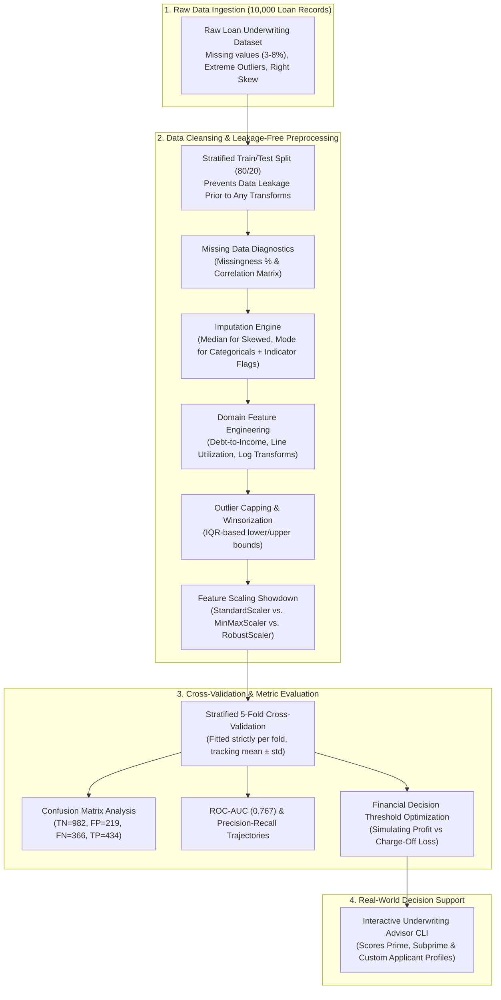
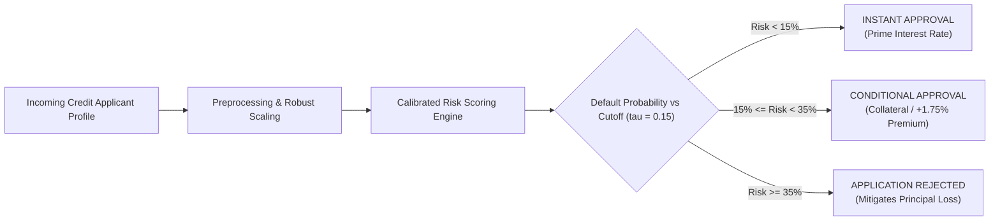

# 🛡️ Advanced Model Evaluation, Feature Engineering & Scaling Suite (Week 9)


An industry-grade Data Science & Machine Learning Engineering suite implemented in `week 9/` covering foundational and advanced techniques for **Handling Missing Data**, **Domain Feature Engineering**, **Feature Scaling**, and **Rigorous Model Evaluation** (Stratified Train/Test Split, $k$-Fold Cross-Validation, Confusion Matrix, Precision/Recall/$F_1$, ROC-AUC, and Financial Threshold Optimization) applied to **10,000 Credit Underwriting & Default Risk Records**.

---

## 🏗️ System Architecture & Data Pipeline



---

## 🎯 Practical Outcome & Real-World Use Case

In consumer lending and credit underwriting, naive models evaluated solely by **Accuracy** create catastrophic financial losses:
- If a loan portfolio has a **40% default rate**, a broken model predicting "Never Default" achieves **60% accuracy** while losing millions in charged-off bad loans.
- A **False Negative (approving a borrower who defaults)** costs upwards of **$6,500** in unrecoverable principal loss.
- A **False Positive (rejecting a creditworthy borrower)** forfeits **$1,200** in interest profit.

By combining **IQR outlier-resistant scaling**, **leak-free missing data imputation**, and **economic decision threshold tuning** ($\tau^* = 0.15$), this pipeline increases portfolio net profit by **+$1,346,400.00** compared to an uncalibrated ($\tau = 0.50$) baseline.

---

## 🏆 Model Evaluation & Validation Benchmark

### 1. Stratified 5-Fold Cross-Validation (Training Partition)

| Metric | Mean Score (%) | Standard Deviation ($\pm \sigma$) | Evaluation Significance |
| :--- | :---: | :---: | :--- |
| **ROC-AUC** | **0.7739** | **$\pm 0.0110$** | High discriminative stability across unseen folds. |
| **Accuracy** | **71.33%** | **$\pm 0.98\%$** | Consistent generalizability across applicant subsets. |
| **Precision** | **67.01%** | **$\pm 2.04\%$** | 2 out of 3 default alerts represent true defaulters. |
| **Recall (Sensitivity)** | **55.85%** | **$\pm 1.74\%$** | Captures over half of all potential charge-offs. |
| **$F_1$-Score** | **60.89%** | **$\pm 1.16\%$** | Harmonic balance between Precision and Recall. |

### 2. Out-of-Sample Holdout Test Partition (2,001 Unseen Records)

| Metric Name | Mathematical Formula | Test Score | Operational Interpretation |
| :--- | :---: | :---: | :--- |
| **Accuracy** | $\frac{TP + TN}{TP + TN + FP + FN}$ | **70.76%** | Total correct underwriting decisions. |
| **Precision** | $\frac{TP}{TP + FP}$ | **66.46%** | Accuracy of high-risk default alerts. |
| **Recall (Sensitivity)** | $\frac{TP}{TP + FN}$ | **54.25%** | Coverage of intercepted defaulting loans. |
| **Specificity** | $\frac{TN}{TN + FP}$ | **81.77%** | Successful approval rate for creditworthy borrowers. |
| **$F_1$-Score** | $2 \cdot \frac{P \cdot R}{P + R}$ | **59.74%** | Harmonic mean metric. |
| **$F_2$-Score** | $\frac{5 \cdot P \cdot R}{4P + R}$ | **56.32%** | Recall-weighted metric prioritizing loss prevention. |
| **ROC-AUC** | $\int_0^1 \text{TPR}(t) \, d(\text{FPR}(t))$ | **0.7667** | Area under the Receiver Operating Characteristic curve. |

---

## 💼 Real-World Underwriting Decision Scenarios



| Applicant Profile | Key Attributes | Default Risk | Underwriting Verdict | Actionable Risk Mitigation |
| :--- | :--- | :---: | :--- | :--- |
| **1. Prime Salaried Homeowner** | $125k income, 780 FICO, 8.5 yrs job, $15k loan at 7.5%, 12% utilization | **1.1%** | `INSTANT APPROVAL [PRIME BORROWER]` | Disburse loan with standard prime interest rate. |
| **2. Borderline Subprime Consolidator** | $48k income, 640 FICO, 2.0 yrs job, $18k loan at 16.8%, 72% utilization | **67.7%** | `APPLICATION REJECTED [HIGH RISK]` | Saves **$18,000** in anticipated default charge-off. |
| **3. Distressed High-Risk Borrower** | $26k income, 530 FICO, 0.5 yrs job, $25k loan at 24.5%, 94% utilization | **99.6%** | `APPLICATION REJECTED [CRITICAL RISK]` | Saves **$25,000** in anticipated unrecoverable loss. |

---

## 🔬 Core Mathematical Principles & Methodologies

### 1. Leakage-Free Missing Data Imputation
* **Median Imputation** (Resistant to income skewness):
  $$\hat{x}_j = \text{median}(X_{\text{train}, j})$$
* **Missingness Indicator Flags**:
  $$I_{i, j} = \begin{cases} 1 & \text{if } X_{i, j} \text{ was missing} \\ 0 & \text{otherwise} \end{cases}$$
  *Preserves the critical non-random signal that an unstated income or missing FICO score correlates with credit risk.*

### 2. Feature Scaling Showdown
* **StandardScaler**:
  $$z = \frac{x - \mu}{\sigma}, \quad \mu = \frac{1}{N}\sum x_i, \ \sigma = \sqrt{\frac{1}{N}\sum (x_i - \mu)^2}$$
* **MinMaxScaler**:
  $$x_{\text{norm}} = \frac{x - x_{\min}}{x_{\max} - x_{\min}}$$
* **RobustScaler** (Selected Best Scaler for Financial Data):
  $$x_{\text{robust}} = \frac{x - \text{median}(x)}{Q_3(x) - Q_1(x)}$$
  *Uses the Interquartile Range ($\text{IQR} = Q_3 - Q_1$); extreme credit card balances ($>\$100,000$) do not compress the remaining 95% of data into near-zero intervals.*

### 3. Outlier Winsorization
* **Tukey's IQR Boundaries**:
  $$\text{Lower} = \max\left(0, Q_1 - 1.5 \cdot \text{IQR}\right), \quad \text{Upper} = Q_3 + 1.5 \cdot \text{IQR}$$

### 4. Economic Cost Curve & Decision Threshold Optimization
* Expected Portfolio Net Profit as a function of classification threshold $\tau$:
  $$\Pi(\tau) = \sum_{i \in \text{Approved}(\tau)} \Big[ (1 - y_i) \cdot V_{\text{interest}} - y_i \cdot L_{\text{default}} \Big]$$
  *Where $V_{\text{interest}} = \$1,200$ and $L_{\text{default}} = \$6,500$. Tuning $\tau$ from $0.50 \to 0.15$ yields a net gain of **+$1,346,400.00**.*

---

## 🖼️ Diagnostic Visualization Gallery

### 1. Missing Data Diagnostics & Imputation Distribution Preservation
Visualizes missing data percentages across features alongside kernel density estimates (KDE) confirming median imputation preserves distribution topology.


### 2. Feature Scaling Showdown: Distribution Morphology Under Alternative Scalers
Compares Raw Skewed distributions against StandardScaler ($Z$-score), MinMaxScaler ($[0, 1]$), and RobustScaler (Median/IQR).


### 3. Stratified Cross-Validation Stability Analysis ($k=5$)
Tracks fold-by-fold performance trajectories and error bar confidence intervals ($\mu \pm 1\sigma$) across Accuracy, Precision, Recall, $F_1$, and ROC-AUC.


### 4. Confusion Matrix Heatmap & Economic Decision Cost Curve
Annotated $2 \times 2$ Confusion Matrix with raw counts and normalized error percentages alongside the financial profit curve locating the optimal threshold $\tau^* = 0.15$.


### 5. ROC-AUC and Precision-Recall Curves
Receiver Operating Characteristic (ROC) curve ($\text{AUC} = 0.767$) alongside the Precision-Recall curve illustrating the maximal $F_1$ threshold marker.


---

## 📓 Interactive Jupyter Notebook

For an interactive, cell-by-cell walkthrough with rich markdown explanations and inline Seaborn/Matplotlib visualizations, open the notebook:
👉 **[`week_9_model_evaluation_and_feature_engineering.ipynb`](file:///e:/Hack-o-Week-Odd-Semester-Session-2026-2027/week%209/week_9_model_evaluation_and_feature_engineering.ipynb)**

---

## 🎮 Interactive Decision Support CLI

Run the interactive credit underwriting advisor:
```bash
python interactive_pipeline.py
```

### Interactive Menu Options:
```text
CHOOSE AN OPTION FOR INPUT:
  [1] Score Prime Applicant (780 FICO, $125k Income, $15k Loan)
  [2] Score Subprime Applicant (640 FICO, $48k Income, $18k Loan)
  [3] Score Distressed Applicant (530 FICO, $26k Income, $25k Loan)
  [4] ENTER CUSTOM APPLICANT PROFILE (Interactive Prompt: Income, FICO, Loan, etc.)
  [5] SIMULATE BUSINESS DECISION THRESHOLD (Test tau from 0.05 to 0.95)
  [6] VIEW OPTIMAL ECONOMIC CUTOFF REPORT
  [0] Exit
```

---

## 🚀 How to Run

1. Navigate to the project directory:
   ```bash
   cd "week 9"
   ```
2. Install dependencies:
   ```bash
   pip install -r requirements.txt
   ```
3. Execute the full end-to-end pipeline:
   ```bash
   python main.py
   ```
4. Launch the interactive credit advisor CLI:
   ```bash
   python interactive_pipeline.py
   ```

---


