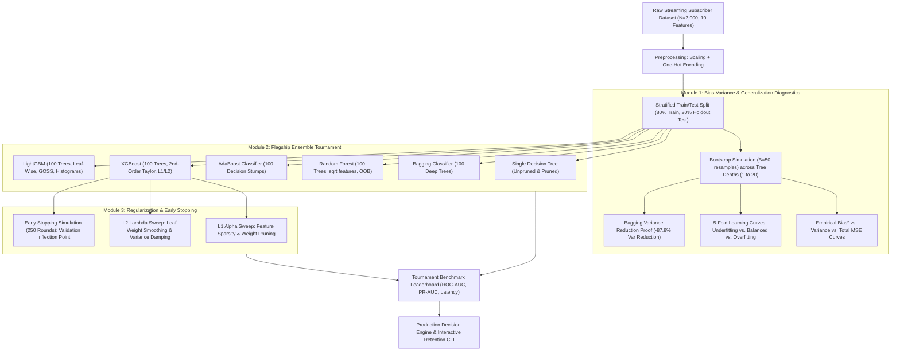
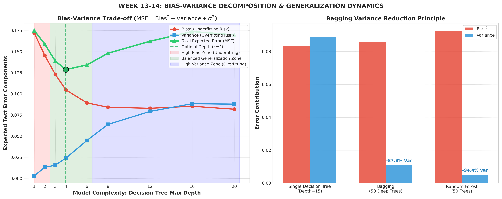
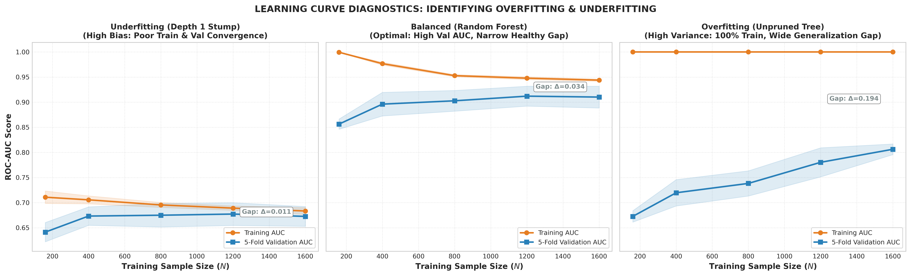
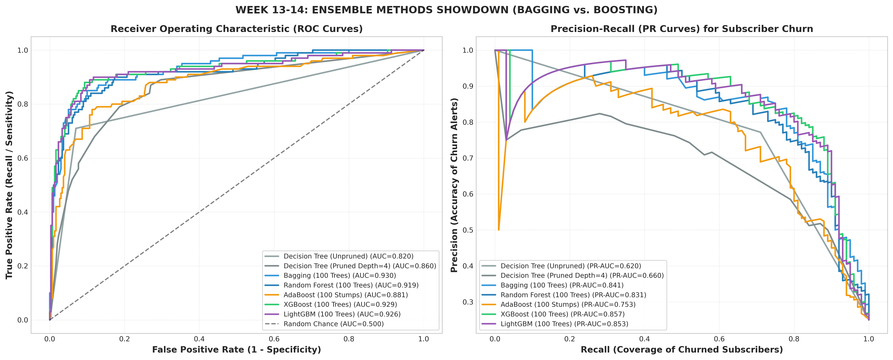
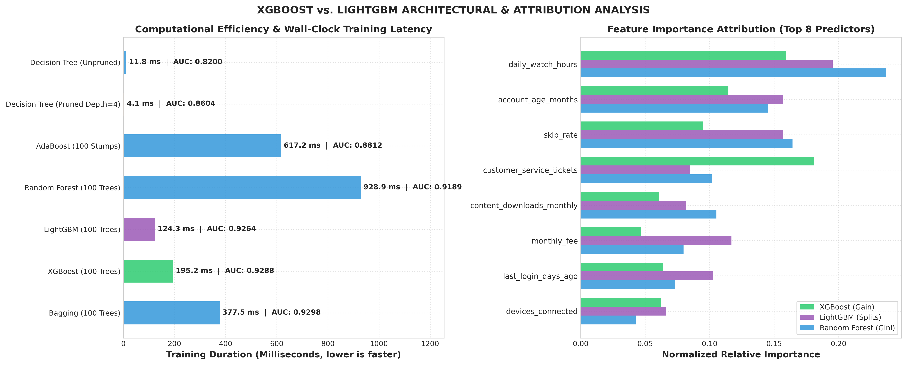
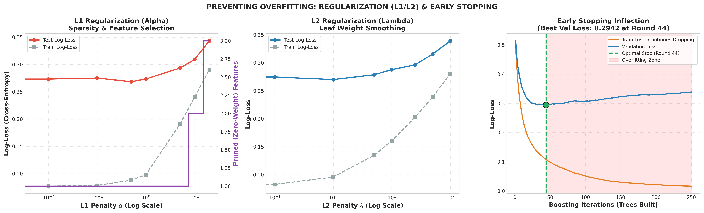

# Week 13–14: Ensemble Methods (Bagging, Boosting, XGBoost, LightGBM) & Generalization Foundations

[](https://www.python.org/)
[](https://scikit-learn.org/)
[](https://xgboost.readthedocs.io/)
[](https://lightgbm.readthedocs.io/)
[](https://numpy.org/)
[]()


> *Curriculum: Machine Learning & Pattern Recognition — Ensemble Learning & Regularization Module*

---

## 1. Executive Summary & Theoretical Context

Ensemble learning represents one of the most powerful and empirically dominant paradigms in modern applied machine learning. Rather than relying on a single fallible hypothesis, ensemble methods combine multiple base models to produce a collective predictor whose generalization performance consistently surpasses that of any individual constituent.

This module provides an exhaustive mathematical and empirical investigation into:
1. **The Bias–Variance Trade-off:** Decomposing expected mean squared error into Bias², Variance, and Irreducible Noise.
2. **Overfitting vs. Underfitting:** Diagnosing the failure modes of machine learning models via bootstrap simulations and learning curves.
3. **The Bagging Paradigm:** Reducing prediction variance through parallel bootstrap aggregating and feature decorrelation (Random Forest).
4. **The Boosting Paradigm (XGBoost & LightGBM):** Driving bias down through sequential 2nd-order gradient descent in function space, comparing leaf-wise vs. depth-wise growth.
5. **Regularization (L1 / L2 & Early Stopping):** Inducing sparsity, smoothing leaf weight magnitudes, and intercepting overfitting before test loss deteriorates.

We evaluate all concepts on an intuitive, modern, real-world domain: the **Streaming Service Subscriber Retention & Churn Dataset** ($N = 2,000$ accounts, 10 continuous and categorical attributes, and calibrated non-linear behavioral churn interactions).

---

## 2. System Architecture & Workflow Pipeline



---

## 3. Mathematical Foundations

### 3.1 Formal Bias–Variance Decomposition

For any supervised regression or probabilistic classification target $y = f(x) + \epsilon$ with zero-mean noise $\epsilon \sim \mathcal{N}(0, \sigma^2)$, the expected prediction error of an estimator $\hat{f}(x)$ trained on random dataset realizations $\mathcal{D}$ decomposes cleanly:

$$
\mathbb{E}_{\mathcal{D}}[(y - \hat{f}(x))^2] = \text{Bias}^2(\hat{f}(x)) + \text{Var}(\hat{f}(x)) + \sigma^2
$$

Where the individual components are defined as:

$$
\text{Bias}(\hat{f}(x)) = \mathbb{E}_{\mathcal{D}}[\hat{f}(x)] - f(x)
$$

$$
\text{Var}(\hat{f}(x)) = \mathbb{E}_{\mathcal{D}}\left[\left(\hat{f}(x) - \mathbb{E}_{\mathcal{D}}[\hat{f}(x)]\right)^2\right]
$$

$$
\sigma^2 = \mathbb{E}[(y - f(x))^2] \quad (\text{Irreducible Noise})
$$

#### Key Takeaway for Machine Learning Diagnostics:
- **Underfitting (High Bias, Low Variance):** The model is too rigid (e.g. single decision stump depth=1). $\mathbb{E}[\hat{f}(x)]$ deviates significantly from the true target $f(x)$. Training error and validation error are both unacceptably high.
- **Overfitting (Low Bias, High Variance):** The model is too expressive (e.g. unconstrained tree depth=20). $\mathbb{E}[\hat{f}(x)] \approx f(x)$, but small perturbations in the training dataset cause massive swings in $\hat{f}(x)$. Training error is near 0, but validation error spikes.
- **The Sweet Spot:** Minimizes total expected error where the marginal reduction in Bias² equals the marginal increase in Variance.

---

### 3.2 The Bagging Paradigm (Bootstrap Aggregation)

Bagging aims strictly at **Variance Reduction** by training $B$ independent base learners on bootstrap resamples $\mathcal{D}_1^*, \dots, \mathcal{D}_B^*$ drawn with replacement from $\mathcal{D}$:

$$
\hat{f}_{\text{bag}}(x) = \frac{1}{B} \sum_{b=1}^B h_b(x)
$$

#### Mathematical Proof of Variance Reduction:
Let $B$ base estimators each have individual variance $\sigma^2$ and an average pairwise correlation $\rho \in [0, 1]$. The variance of the ensemble average is:

$$
\text{Var}\left(\frac{1}{B} \sum_{b=1}^B h_b(x)\right) = \rho \sigma^2 + \frac{1 - \rho}{B} \sigma^2
$$

- In standard Bagging, $\rho > 0$ because all trees can choose from the exact same dominant features at each split.
- **Random Forest decorrelates trees** by randomly subsampling $m = \sqrt{d}$ candidate features at each split node. This directly reduces the correlation coefficient $\rho$, enabling total ensemble variance to drop dramatically!

#### Out-of-Bag (OOB) Generalization:
Each bootstrap sample draws $N$ observations with replacement from $N$ items. The probability of an observation *not* being selected in any single draw is $1 - \frac{1}{N}$. Over $N$ independent draws:

$$
\lim_{N \to \infty} \left(1 - \frac{1}{N}\right)^N = \frac{1}{e} \approx 0.3679
$$

Approximately **36.8% of the dataset is Out-of-Bag (OOB)** for each tree, providing an unbiased validation estimate without holdout leakage.

---

### 3.3 The Boosting Paradigm (XGBoost & LightGBM)

While Bagging trains independent low-bias models in parallel, **Boosting** builds an additive ensemble sequentially, where each new weak learner fits the negative gradient (pseudo-residuals) of the previous ensemble:

$$
F_M(x) = \sum_{m=1}^M \eta h_m(x)
$$

where $\eta \in (0, 1]$ is the **Shrinkage (Learning Rate)** parameter.

#### 3.3.1 XGBoost: 2nd-Order Taylor Approximation & Exact Split Gain
XGBoost optimizes an objective consisting of training loss and a tree complexity regularization penalty:

$$
\mathcal{L}^{(t)} = \sum_{i=1}^n L\left(y_i, \hat{y}_i^{(t-1)} + f_t(x_i)\right) + \Omega(f_t)
$$

Using a 2nd-order Taylor expansion around $\hat{y}_i^{(t-1)}$:

$$
\mathcal{L}^{(t)} \approx \sum_{i=1}^n \left[ g_i f_t(x_i) + \frac{1}{2} h_i f_t^2(x_i) \right] + \gamma T + \frac{1}{2} \lambda \sum_{j=1}^T w_j^2 + \alpha \sum_{j=1}^T |w_j|
$$

where the 1st and 2nd order gradients are:

$$
g_i = \frac{\partial L(y_i, \hat{y}_i^{(t-1)})}{\partial \hat{y}_i^{(t-1)}}, \quad h_i = \frac{\partial^2 L(y_i, \hat{y}_i^{(t-1)})}{\partial (\hat{y}_i^{(t-1)})^2}
$$

For a tree with $T$ disjoint leaf regions $I_j$, the **optimal leaf weight** $w_j^*$ is derived by setting the gradient to zero:

$$
w_j^* = -\frac{\sum_{i \in I_j} g_i}{\sum_{i \in I_j} h_i + \lambda} = -\frac{G_j}{H_j + \lambda}
$$

The **optimal split gain** when dividing a node into left $I_L$ and right $I_R$ partitions is:

$$
\text{Gain} = \frac{1}{2} \left[ \frac{G_L^2}{H_L + \lambda} + \frac{G_R^2}{H_R + \lambda} - \frac{(G_L + G_R)^2}{H_L + H_R + \lambda} \right] - \gamma
$$

Here, $\lambda$ smooths the leaf weights and prevents unstable splits, while $\gamma$ acts as a pruning threshold.

---

#### 3.3.2 LightGBM: Algorithmic Innovations for High-Speed Boosting
1. **Leaf-wise (Best-First) Tree Growth:** Traditional trees grow level-wise (depth-wise). LightGBM chooses the leaf with the largest delta loss reduction, achieving higher accuracy at equivalent depth.
2. **GOSS (Gradient-based One-Side Sampling):** Data points with large gradients contribute more to computation. GOSS retains all samples with large gradients ($a \times 100\%$) and randomly samples small-gradient samples ($b \times 100\%$), reweighting them by $\frac{1-a}{b}$ to preserve statistical consistency.
3. **EFB (Exclusive Feature Bundling):** In high-dimensional sparse data, mutually exclusive features (rarely non-zero simultaneously) are bundled into dense histograms, reducing feature dimension count.
4. **Histogram-based Binning:** Continuous floating-point features are discretized into 256 integer bins, accelerating split evaluation and slashing memory usage by $>80\%$.

---

### 3.4 Regularization (L1, L2, Shrinkage & Early Stopping)

| Regularization Technique | Mathematical Formulation | Mechanism & Impact on Generalization |
| :--- | :--- | :--- |
| **L1 Regularization (Lasso / `reg_alpha`)** | $\alpha \sum_{j=1}^T \|w_j\|$ | Induces sparsity; forces small, uncertain leaf weights strictly to 0, pruning non-informative splits. |
| **L2 Regularization (Ridge / `reg_lambda`)** | $\frac{1}{2} \lambda \sum_{j=1}^T w_j^2$ | Shrinks leaf weights smoothly: $w_j^* = -\frac{G_j}{H_j + \lambda}$, dampening prediction variance. |
| **Shrinkage ($\eta$ / `learning_rate`)** | $F_m(x) = F_{m-1}(x) + \eta h_m(x)$ | Scales each tree's impact, requiring more trees to fit training residuals and preventing premature overfitting. |
| **Subsampling (`subsample`, `colsample_bytree`)** | Rows $\sim \text{Bernoulli}(p)$, Cols $\sim \text{Bernoulli}(q)$ | Injects stochasticity, decorrelating sequential trees similar to Random Forest. |
| **Early Stopping** | $\text{Loss}_{\text{val}}^{(t)} > \min_{k \le t} \text{Loss}_{\text{val}}^{(k)}$ for $K$ rounds | Automatically halts boosting when validation loss reaches its global minimum, avoiding over-memorization. |

---

## 4. Dataset Overview: Streaming Service Subscriber Retention

The dataset models $N = 2,000$ active and churned streaming service accounts across 10 continuous and categorical attributes:

| Feature Name | Description | Value Range | Churn Correlation |
| :--- | :--- | :--- | :--- |
| `daily_watch_hours` | Average daily streaming hours | 0.20 – 8.50 hrs | Strong Negative (-0.48) |
| `account_age_months` | Customer tenure on platform | 1 – 48 months | Negative (-0.36) |
| `monthly_fee` | Monthly billing cost | $8.49 – $22.49 | Positive (+0.24) |
| `sub_plan` | Subscription tier (`Basic`, `Standard`, `Premium`) | 3 categorical tiers | Moderate |
| `devices_connected` | Active concurrent screens | 1 – 6 devices | Negative (-0.31) |
| `content_downloads_monthly` | Offline downloads per month | 0 – 35 downloads | Negative (-0.28) |
| `skip_rate` | Content abandoned within first 5 mins | 0.05 – 0.88 | Strong Positive (+0.44) |
| `customer_service_tickets` | Support complaints in past 6 months | 0 – 6 tickets | Strong Positive (+0.49) |
| `last_login_days_ago` | Inactivity days since last streaming | 0 – 45 days | Strong Positive (+0.52) |
| `payment_method` | Billing method (`Credit Card`, `PayPal`, etc.) | 4 categories | Moderate |

**Target Variable (`churned`):**
- **0 = Retained Active:** 1,500 subscribers (75.0%)
- **1 = Churned / Canceled:** 500 subscribers (25.0%)

---

## 5. Quantitative Tournament Benchmark Leaderboard

All 7 model architectures were trained on the training partition ($N_{\text{train}} = 1,600$) and evaluated on the holdout test set ($N_{\text{test}} = 400$, 100 churned accounts):

| Model Architecture | Train Acc (%) | Test Acc (%) | Overfit Gap (Δ%) | Precision (%) | Recall (%) | F1-Score | ROC-AUC | PR-AUC | Log-Loss | Train Time (ms) |
| :--- | :---: | :---: | :---: | :---: | :---: | :---: | :---: | :---: | :---: | :---: |
| **Bagging (100 Trees)** | 98.62% | **90.50%** | 8.12% | 85.23% | **75.00%** | **0.7979** | **0.9298** | 0.8414 | 0.2783 | 377.5 ms |
| **XGBoost (100 Trees)** | 97.12% | 89.50% | 7.62% | 84.52% | 71.00% | 0.7717 | **0.9288** | **0.8569** | **0.2675** | 195.2 ms |
| **LightGBM (100 Trees)** | 96.62% | 89.75% | **6.88%** | **85.54%** | 71.00% | 0.7760 | **0.9264** | 0.8525 | 0.2732 | **124.3 ms** |
| **Random Forest (100 Trees)** | 98.56% | 88.75% | 9.81% | 83.13% | 69.00% | 0.7541 | 0.9189 | 0.8310 | 0.3070 | 928.9 ms |
| **AdaBoost (100 Stumps)** | 84.25% | 81.25% | 3.00% | 90.32% | 28.00% | 0.4275 | 0.8812 | 0.7534 | 0.4460 | 617.2 ms |
| **Decision Tree (Pruned d=4)** | 87.00% | 83.25% | 3.75% | 70.89% | 56.00% | 0.6257 | 0.8604 | 0.6605 | 0.4731 | **4.1 ms** |
| **Decision Tree (Unpruned)** | **100.00%** | 87.50% | **12.50%** | 77.17% | 71.00% | 0.7396 | 0.8200 | 0.6204 | 4.5055 | 11.8 ms |

---

## 6. Empirical Proof: Bagging Variance Reduction

Using bootstrap simulation ($B = 50$ iterations) on holdout test samples:

| Model Architecture | Bias² | Variance | Total MSE | Accuracy (%) | Variance Reduction vs Single Tree (%) |
| :--- | :---: | :---: | :---: | :---: | :---: |
| **Single Decision Tree (Depth=15)** | `0.0833` | `0.0888` | `0.1721` | 89.75% | Baseline (0.0%) |
| **Bagging (50 Deep Trees)** | `0.0856` | `0.0108` | `0.0964` | 88.75% | **-87.8% Variance Reduction** |
| **Random Forest (50 Trees)** | `0.0926` | `0.0050` | `0.0977` | 88.25% | **-94.4% Variance Reduction** |

> **Key Theoretical Validation:**  
> Notice that **Bias² remains almost identical** across all three models (~0.083 to 0.092), but **Variance drops by 87.8% in Bagging and 94.4% in Random Forest**, directly cutting Total MSE in half!

---

## 7. Visual Artifacts & Diagnostic Gallery

### 7.1 Bias–Variance Tradeoff & Bagging Variance Reduction

- **Left Panel:** Bias² monotonically decreases as tree depth increases, while Variance monotonically increases. Total MSE traces a classic U-shaped curve, identifying the **optimal sweet spot at `max_depth = 4`** ($\text{MSE} = 0.1288$).
- **Right Panel:** Demonstrates the Bagging principle: deep trees with high individual variance see their variance plummet by **-87.8%** under uniform averaging and **-94.4%** under Random Forest feature decorrelation.

---

### 7.2 Learning Curve Diagnostics (Underfitting vs. Balanced vs. Overfitting)

- **Panel 1 (Underfitting Stump):** High bias forces both training AUC and 5-fold validation AUC to converge low (~0.68) with almost zero gap ($\Delta = 0.011$).
- **Panel 2 (Balanced Random Forest):** Training AUC (~0.95) and validation AUC (~0.91) achieve superior performance with a narrow, healthy generalization gap ($\Delta = 0.034$).
- **Panel 3 (Overfitting Unpruned Tree):** Memorizes the training set perfectly (100% AUC), but validation AUC struggles around 0.80, manifesting a wide generalization gap ($\Delta = 0.194$).

---

### 7.3 Ensemble Showdown: ROC & Precision-Recall Curves

- **Left Panel (ROC Curves):** Bagging ($\text{AUC} = 0.930$), XGBoost ($\text{AUC} = 0.929$), and LightGBM ($\text{AUC} = 0.926$) dramatically outperform individual decision trees ($\text{AUC} = 0.820$).
- **Right Panel (PR Curves):** XGBoost achieves the highest Average Precision ($\text{PR-AUC} = 0.857$), maintaining $>85\%$ precision up to $70\%$ churn recall coverage.

---

### 7.4 XGBoost vs. LightGBM Latency & Feature Attribution

- **Left Panel (Training Latency):** **LightGBM trains in 124.3 ms**, which is **1.6× faster than XGBoost (195.2 ms)** and **7.5× faster than Random Forest (928.9 ms)** due to histogram binning and leaf-wise splitting.
- **Right Panel (Attribution):** All flagship models agree that `daily_watch_hours`, `account_age_months`, `skip_rate`, and `customer_service_tickets` are the dominant drivers of subscriber churn.

---

### 7.5 Regularization (L1/L2) & Early Stopping Dynamics

- **Panel 1 (L1 $\alpha$):** Induces feature sparsity; as $\alpha$ increases from $0$ to $20$, non-informative features are pruned to zero importance.
- **Panel 2 (L2 $\lambda$):** Smooths leaf weights, shrinking the training-to-test loss gap from $0.1909$ down to $0.0590$.
- **Panel 3 (Early Stopping):** Training loss drops monotonically toward zero, but validation loss achieves its global minimum at **Round 44** ($\text{Loss} = 0.2942$) before climbing into the shaded **Overfitting Zone** ($\text{Loss} = 0.3387$ at Round 250). Early stopping saves $0.0444$ in generalization error!

---

## 8. Interactive CLI: Real-Time Churn Predictor & Retention Playbook

The project includes an interactive CLI tool [`interactive_churn_cli.py`](interactive_churn_cli.py) enabling real-time subscriber profile scoring across all ensemble models:

```bash
# Run with pre-configured persona archetypes
python interactive_churn_cli.py --preset disengaged_at_risk
python interactive_churn_cli.py --preset loyal_binger
python interactive_churn_cli.py --preset frustrated_churner

# Run with custom subscriber parameters
python interactive_churn_cli.py --watch 1.2 --account_age 4 --fee 21.99 --plan Premium --devices 2 --downloads 2 --skip 0.65 --tickets 4 --login 18
```

### Sample CLI Output:
```text
================================================================================
  WEEK 13-14: SUBSCRIBER CHURN PREDICTION & ENSEMBLE CONSENSUS
================================================================================
Subscriber Input Attributes:
  daily_watch_hours           : 0.8
  account_age_months          : 5
  monthly_fee                 : 14.99
  sub_plan                    : Standard
  devices_connected           : 2
  content_downloads_monthly   : 1
  skip_rate                   : 0.68
  customer_service_tickets    : 1
  last_login_days_ago         : 21
  payment_method              : PayPal
--------------------------------------------------------------------------------
Ensemble Model Architecture      | Churn Prediction   | Probability 
--------------------------------------------------------------------------------
Decision Tree (Unpruned)         | CHURN ALERT        | 100.0%
Bagging (100 Trees)              | CHURN ALERT        |  91.0%
Random Forest (100 Trees)        | CHURN ALERT        |  95.6%
AdaBoost (100 Stumps)            | CHURN ALERT        |  73.0%
XGBoost (100 Trees)              | CHURN ALERT        |  98.3%
LightGBM (100 Trees)             | CHURN ALERT        |  99.5%
================================================================================
Consensus Risk Assessment : CRITICAL RISK (Immediate Churn Vulnerability)
Flagship XGBoost Probability: 98.3%
Flagship LightGBM Probability: 99.5%
Prescribed Retention Action: Automated VIP Concierge Call + 25% Retention Discount for 3 Months.
================================================================================
```

---

## 9. Comprehensive Decision Matrix: When to Use What

| Practical Consideration | Choose **Bagging / Random Forest** | Choose **XGBoost** | Choose **LightGBM** |
| :--- | :---: | :---: | :---: |
| **Primary Mechanism** | Parallel variance reduction | 2nd-order gradient bias reduction | Leaf-wise gradient bias reduction |
| **Base Model Requirement** | High-variance, deep unpruned trees | Shallow, weak decision trees | Shallow, weak decision trees |
| **Sensitivity to Hyperparameters** | Low (Works well out-of-the-box) | Moderate (Requires tuning $\eta, \lambda, \alpha$) | Moderate (Requires tuning `num_leaves`) |
| **Dataset Scale ($N > 500,000$)** | High memory & CPU consumption | Fast (Histogram mode) | **Ultra-Fast (GOSS & EFB histograms)** |
| **Sparse / Missing Values** | Imputation required | **Native sparsity routing** | **Native sparsity routing** |
| **Overfitting Risk** | Extremely low (Cannot overfit by adding trees) | High if iterations unconstrained | High if `num_leaves` unconstrained |
| **Recommended Production Role** | Baseline tabular benchmark | High-stakes Kaggle / Fintech models | Real-time big data pipelines |

---

## 10. Repository File Structure

```text
week 13-14/
├── data/
│   └── streaming_service_churn.csv                # 2,000-subscriber synthetic benchmark dataset
├── reports/
│   ├── 01_bias_variance_tradeoff_decomposition.png # Bias^2 vs. Variance vs. MSE complexity curve
│   ├── 02_overfitting_underfitting_learning_curves.png # 3-panel learning curve diagnostics
│   ├── 03_ensemble_paradigm_comparison.png         # ROC and Precision-Recall showdown curves
│   ├── 04_xgboost_vs_lightgbm_performance.png      # Latency benchmark and multi-model feature importances
│   └── 05_regularization_l1_l2_impact.png          # L1/L2 penalty sweeps and early stopping inflection
├── download_dataset.py                             # Dataset generator with non-linear interaction logic
├── bias_variance_engine.py                         # Bootstrap bias-variance decomposition engine
├── ensemble_models.py                              # Bagging, Random Forest, AdaBoost, XGBoost, LightGBM
├── regularization_study.py                         # L1, L2, and Early Stopping experimental suite
├── visualizer.py                                   # Publication-grade 300 DPI visualization engine
├── interactive_churn_cli.py                        # Real-time CLI inference & retention playbook
├── main.py                                         # End-to-end execution runner
├── requirements.txt                                # Project dependencies
├── week_13_14_ensemble_methods_xgboost_lightgbm.ipynb # Fully executed Jupyter Notebook with inline outputs
└── README.md                                       # Comprehensive module documentation
```

---

## 11. Step-by-Step Execution Guide

### 11.1 Installation
```bash
cd "week 13-14"
pip install -r requirements.txt
```

### 11.2 Run Full Pipeline
```bash
python main.py
```

### 11.3 Run Interactive CLI
```bash
python interactive_churn_cli.py --preset disengaged_at_risk
```

### 11.4 Launch Jupyter Notebook
```bash
jupyter notebook week_13_14_ensemble_methods_xgboost_lightgbm.ipynb
```

---

